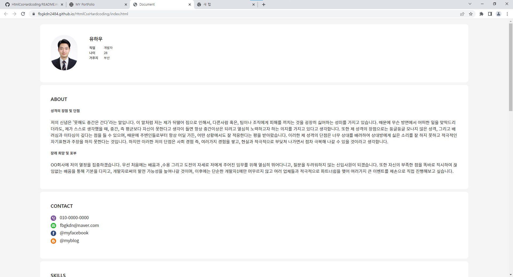
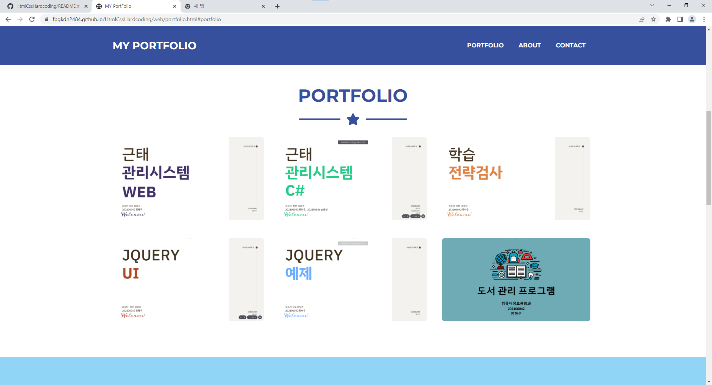

# HtmlCssHardcoding

객체지향프로그래밍실무 과제 및 포트폴리오입니다.

link : [자기소개페이지](https://introducerhw.netlify.app/)

## 자기소개 페이지😊
</img>    
1. 해당 링크 클릭시 상단의 이미지와 같은 자기소개 페이지로 이동 
2. 해당 자기소개 페이지에서 간단한 자기소개에 대한 글과 함께 내가 제작한 여러 프로젝트를 영상으로 볼 수 있음
3. 영상 하단의 mysite를 클릭시 내가 만든 ProtFolio 홈페이지로 이동
***
## ProtFolio 홈페이지😛
</img>    
1. 해당 ProtFolio 홈페이지에서 내가 만든 포트폴리오들과 코드들을 간단하게 살펴볼 수 있음
2. 나에 대한 소개부분에서 More Learn!!!버튼을 클릭시 자기소개 페이지로 다시 이동
3. CONTACT ME 부분에서 부트스트랩을 사용하여 나에게 이메일을 간단하게 남길 수 있도록 설계        
   
### 부트스트랩 코드   
```html
<form id="contactForm" data-sb-form-api-token="API_TOKEN">
                            <!-- Name input-->
                            <div class="form-floating mb-3">
                                <input class="form-control" id="name" type="text" placeholder="Enter your name..." data-sb-validations="required" />
                                <label for="name">Full name</label>
                                <div class="invalid-feedback" data-sb-feedback="name:required">A name is required.</div>
                            </div>
                            <!-- Email address input-->
                            <div class="form-floating mb-3">
                                <input class="form-control" id="email" type="email" placeholder="name@example.com" data-sb-validations="required,email" />
                                <label for="email">Email address</label>
                                <div class="invalid-feedback" data-sb-feedback="email:required">An email is required.</div>
                                <div class="invalid-feedback" data-sb-feedback="email:email">Email is not valid.</div>
                            </div>
                            <!-- Phone number input-->
                            <div class="form-floating mb-3">
                                <input class="form-control" id="phone" type="tel" placeholder="(123) 456-7890" data-sb-validations="required" />
                                <label for="phone">Phone number</label>
                                <div class="invalid-feedback" data-sb-feedback="phone:required">A phone number is required.</div>
                            </div>
                            <!-- Message input-->
                            <div class="form-floating mb-3">
                                <textarea class="form-control" id="message" type="text" placeholder="Enter your message here..." style="height: 10rem" data-sb-     validations="required"></textarea>
                                <label for="message">Message</label>
                                <div class="invalid-feedback" data-sb-feedback="message:required">A message is required.</div>
                            </div>
                            <!-- Submit success message-->
                            <!---->
                            <!-- This is what your users will see when the form-->
                            <!-- has successfully submitted-->
                            <div class="d-none" id="submitSuccessMessage">
                                <div class="text-center mb-3">
                                    <div class="fw-bolder">Thanks You!!</div>
                                    
                                    <br />
                                    <!-- <a href="https://startbootstrap.com/solution/contact-forms">https://startbootstrap.com/solution/contact-forms</a> -->
                                </div>
                            </div>
                            <!-- Submit error message-->
                            <!---->
                            <!-- This is what your users will see when there is-->
                            <!-- an error submitting the form-->
                            <div class="d-none" id="submitErrorMessage"><div class="text-center text-danger mb-3">Error sending message!</div></div>
                            <!-- Submit Button-->
                            <button class="btn btn-primary btn-xl disabled" style="text-align: center; display: inline-block;" id="submitButton" type="submit" >Send</button>
                        </form>
```   
***   
### Reference    
구글, "마크다운 사용법", https://gist.github.com/ihoneymon/652be052a0727ad59601, (2022.09.30)    
startbootstrap, "Bootstrap themes, templates, and UI tools to help you start your next project!", https://startbootstrap.com, (2022.09.30)     

깃허브 주소 : [자기소개페이지]: https://fbgkdn2484.github.io/HtmlCssHardcoding/ "my site"
